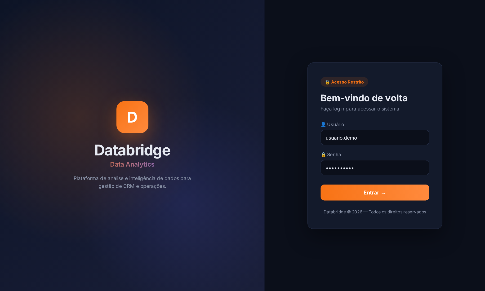
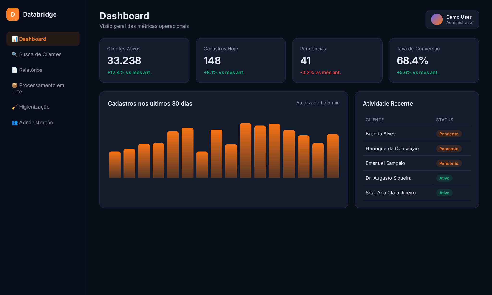
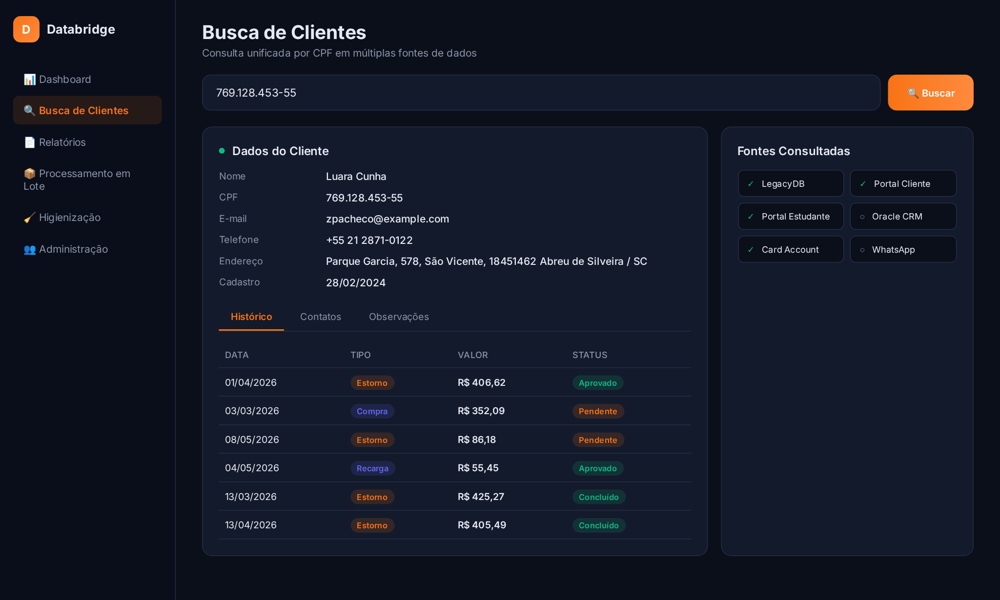
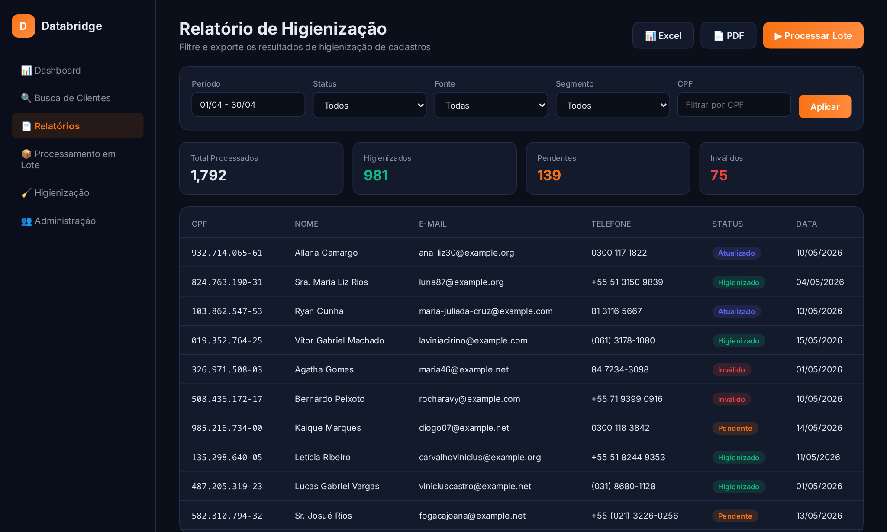

# Databridge Analytics

Dashboard web para análise de dados de CRM — busca, higienização de cartões,
relatórios e processamento em lote, com integração a bancos MySQL e Oracle.

> **Versão pública.** Todos os nomes de empresa, URLs e credenciais foram removidos
> ou substituídos por placeholders genéricos. Conecte ao seu próprio banco de dados
> configurando `core/config.py` a partir do modelo `core/config.example.py`.

---

## Funcionalidades

- **Dashboard** — visão geral de métricas de CRM com atualização automática por scheduler
- **Busca** — consulta unificada de clientes por CPF em múltiplas fontes
- **Relatórios** — geração de relatórios filtráveis e exportação (Excel, PDF)
- **Higienização de cartões** — identificação e correção de inconsistências em cadastros
- **Processamento em lote** — operações em massa via upload de arquivo com progresso em tempo real (SocketIO)
- **Administração** — gerenciamento de usuários e permissões

---

## Screenshots
> Telas ilustrativas geradas com dados fictícios (Faker), sem nenhum dado real.

| Login | Dashboard |
|-------|-----------|
|  |  |

| Busca de Clientes | Relatórios |
|-------------------|------------|
|  |  |

---

## Stack

| Camada        | Tecnologias                                              |
|---------------|----------------------------------------------------------|
| Backend       | Flask, Flask-SocketIO, SQLAlchemy                        |
| Banco de dados| MySQL (via `mysql-connector-python`), Oracle (`oracledb`) |
| Frontend      | HTML/CSS/JS vanilla, CSS customizado                     |
| Relatórios    | ReportLab, WeasyPrint, XlsxWriter                        |
| Agendamento   | APScheduler                                              |
| Deploy        | Gunicorn / Waitress                                      |

---

## Como configurar

### 1. Clone o repositório

```bash
git clone https://github.com/<seu-usuario>/databridge.git
cd databridge
```

### 2. Crie um ambiente virtual e instale as dependências

```bash
python -m venv .venv
source .venv/bin/activate      # Windows: .venv\Scripts\activate
pip install -r requirements.txt
```

### 3. Configure o ambiente

Copie o arquivo de configuração de exemplo e preencha com suas credenciais:

```bash
cp core/config.example.py core/config.py
```

Edite `core/config.py` e configure:

```python
MYSQL_CONFIG = {
    'host':     'seu-host-mysql',
    'user':     'seu-usuario',
    'password': 'sua-senha',
    'database': 'seu-banco',
}

ORACLE_CONFIG = {
    'usuario':  'seu-usuario-oracle',
    'senha':    'sua-senha-oracle',
    'host':     'seu-host-oracle',
    'database': 'seu-service-name',
    'port':     1521,
}
```

Alternativamente, use variáveis de ambiente (recomendado em produção):

```bash
export DATABRIDGE_MYSQL_HOST=seu-host
export DATABRIDGE_MYSQL_USER=seu-usuario
export DATABRIDGE_MYSQL_PASSWORD=sua-senha
export DATABRIDGE_MYSQL_DATABASE=seu-banco
```

### 4. Execute a aplicação

```bash
python app.py
```

Acesse `http://localhost:5004` no navegador.

---

## Estrutura do projeto

```
databridge/
├── app.py                    # Entrada da aplicação Flask + SocketIO
├── core/
│   ├── config.example.py     # Modelo de configuração (sem credenciais)
│   └── database.py           # Engine SQLAlchemy e utilitários de DB
├── modules/
│   ├── admin.py              # Gerenciamento de usuários
│   ├── auth.py               # Autenticação e sessões
│   ├── bulk_process.py       # Processamento em lote com SocketIO
│   ├── card_hygiene.py       # Higienização de cartões
│   ├── contact_fallbacks.py  # Fallbacks de contato
│   ├── dashboard.py          # Dashboard principal e scheduler de cache
│   ├── report.py             # Geração de relatórios
│   └── search.py             # Busca unificada de clientes
├── static/
│   ├── css/style.css         # Estilos globais
│   ├── js/main.js            # Lógica frontend
│   └── logo.png              # Logo (substitua pelo seu)
├── templates/
│   ├── index.html            # Template principal (app autenticado)
│   └── login.html            # Tela de login
├── scripts/
│   └── generate_mockup_screenshots.py  # Gera mockups das telas (Faker + Playwright)
├── screenshots/              # Mockups das telas para o README
├── DEPLOY_GITHUB.md          # Instruções de deploy
├── .gitignore
└── requirements.txt
```

---

## Segurança

- `core/config.py` está no `.gitignore` — nunca commite suas credenciais reais
- Use variáveis de ambiente em produção
- A chave `SECRET_KEY` é gerada automaticamente via `secrets.token_hex(32)` se não configurada

---

## Deploy em produção

Consulte [DEPLOY_GITHUB.md](DEPLOY_GITHUB.md) para instruções de deploy via git pull.

Para produção com Gunicorn:

```bash
gunicorn -w 4 -b 0.0.0.0:5004 app:app
```
